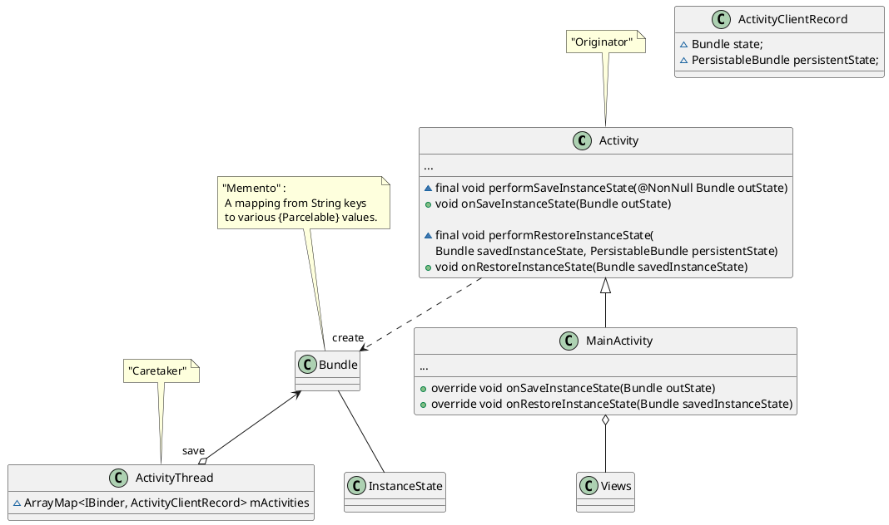

```puml

@startuml

class Activity {
  ...
  ~ final void performSaveInstanceState(@NonNull Bundle outState)
  + void onSaveInstanceState(Bundle outState)
  
  ~ final void performRestoreInstanceState(
            Bundle savedInstanceState, PersistableBundle persistentState)
  + void onRestoreInstanceState(Bundle savedInstanceState)
}

class MainActivity {
  ...
  + override void onSaveInstanceState(Bundle outState)
  + override void onRestoreInstanceState(Bundle savedInstanceState)
}

class ActivityThread {
  ~ ArrayMap<IBinder, ActivityClientRecord> mActivities
}

class ActivityClientRecord {
  ~ Bundle state;
  ~ PersistableBundle persistentState;
}


note top of Activity: "Originator"

Activity <|-- MainActivity
Activity ..>"create" Bundle
MainActivity o-- Views

note top of Bundle: "Memento" : \n A mapping from String keys \n to various {Parcelable} values.

Bundle -- InstanceState
Bundle <--o "save" ActivityThread 

note top of ActivityThread: "Caretaker"

@enduml

```

